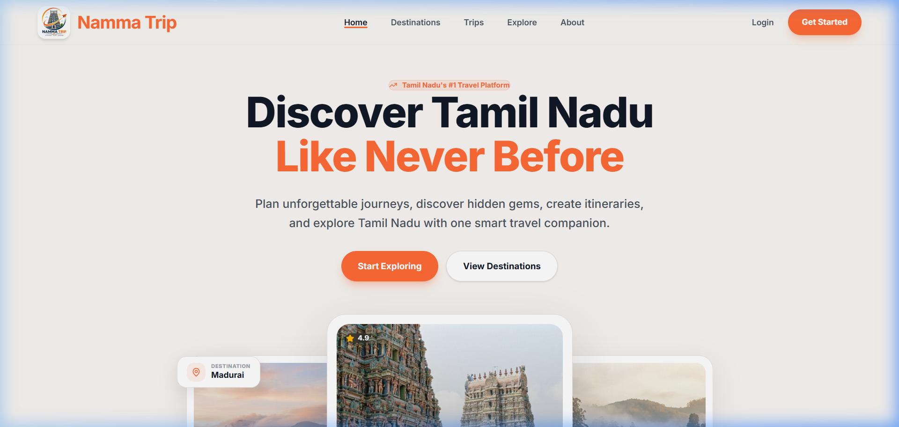

# Namma Trip 🛕🌴



*Tamil Nadu's #1 Travel Platform – Discover Tamil Nadu Like Never Before.*

---

## 🛑 The Problem

Planning a comprehensive and authentic trip to Tamil Nadu can be overwhelming. Information is fragmented across various blogs, booking sites, and forums. Travelers often struggle to:
- Discover hidden gems and offbeat destinations beyond the typical tourist spots.
- Create organized, logical itineraries without spending hours researching.
- Find reliable local partners, guides, and authentic cultural experiences.
- Connect with a community of like-minded travelers to share tips and find travel companions.

The lack of a unified, intelligent travel companion dedicated to Tamil Nadu leaves travelers frustrated and limits their ability to experience the state's true beauty.

## 💡 The Solution

**Namma Trip** is a premium, AI-powered travel discovery and planning platform built exclusively for Tamil Nadu. It serves as a one-stop smart travel companion that simplifies the entire journey from inspiration to execution. 

### Key Features:
- **Curated Destinations:** Explore both popular landmarks (like Meenakshi Temple) and hidden gems (like the misty hills of Kodaikanal) with beautiful, immersive visual showcases.
- **Smart Trip Planning:** Organize your itinerary effortlessly with AI-assisted planning tools.
- **Community Feed & Travel Companions:** Connect with a network of over 1,000+ active travelers. Share your travel posts, find companions, and engage with the community.
- **Seamless Authentication:** Secure login and registration flows to keep your itineraries and preferences saved.
- **Modern, Premium UI:** A clean, intuitive, and responsive interface built with React, Framer Motion, and Tailwind CSS to provide a world-class user experience.

---

## 🛠️ Technology Stack

### Frontend
- **Framework:** React with Vite & TypeScript
- **Styling:** Tailwind CSS v4
- **Animations:** Framer Motion
- **Icons:** Lucide React
- **Routing:** React Router DOM

### Backend
- **Framework:** Spring Boot (Java)
- **Database:** PostgreSQL / H2 (for development)
- **Security:** Spring Security with JWT Authentication
- **AI Integration:** Google Gemini API for smart trip planning

---

## 🚀 Getting Started

### Prerequisites
- Node.js (v18+)
- Java 17+
- Maven

### Frontend Setup
1. Navigate to the frontend directory:
   ```bash
   cd frontend
   ```
2. Install dependencies:
   ```bash
   npm install
   ```
3. Start the development server:
   ```bash
   npm run dev
   ```

### Backend Setup
1. Navigate to the backend directory:
   ```bash
   cd backend
   ```
2. Configure your database settings in `src/main/resources/application.properties`.
3. Run the Spring Boot application:
   ```bash
   mvn spring-boot:run
   ```

---

## 🤝 Contributing

We welcome contributions! Please feel free to submit a Pull Request.

## 📄 License

This project is licensed under the MIT License.
